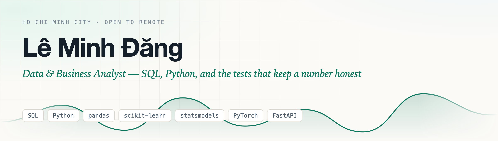
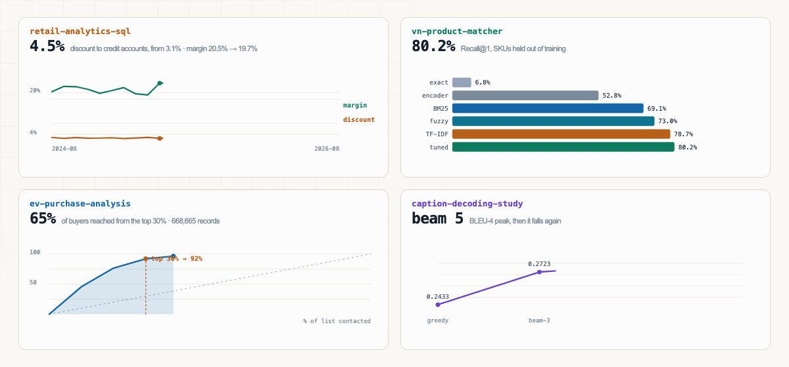
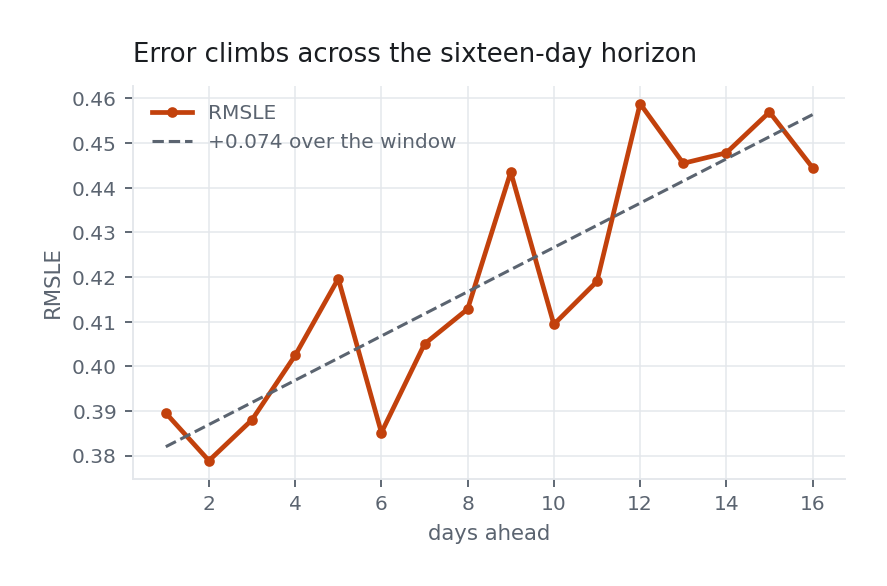

<picture>
  <source media="(prefers-color-scheme: dark)" srcset="assets/banner-dark.png">
  
</picture>

**[Portfolio](https://conchocon154.github.io/)** · [dangleminh6677@gmail.com](mailto:dangleminh6677@gmail.com) · [Kaggle](https://www.kaggle.com/minhngle)  

Computer Science graduate from Ton Duc Thang University, 2025. Most of what I know
came from building an inventory and accounting system for a hardware shop and then
doing the analysis on top of it. FIFO costing, two-way receivables, margin reporting.
It taught me that a report is worth exactly as much as the accounting decisions
underneath it, and not a bit more.

In each project below there is a baseline the method had to beat. Three of them ended
in a result I did not want, and those are written up as carefully as the rest.

<picture>
  <source media="(prefers-color-scheme: dark)" srcset="assets/charts-dark.gif">
  
</picture>

Every series above is read out of the result files in the four repositories — `tools/render_charts.py` rebuilds the animation from them.

**[retail-analytics-sql](https://github.com/conchocon154/retail-analytics-sql)** · SQL · SQLite · pandas  
Eight analytical queries over a simulated hardware shop: 300 SKUs, 25 months, 8,500
invoices. 20 tests check the numbers, one of them guarding a reorder-point bug that
used to inflate average demand thirtyfold.

**[vn-product-matcher](https://github.com/conchocon154/vn-product-matcher)** · PyTorch · sentence-transformers · FastAPI  
Matches free-text Vietnamese product names onto 1,827 catalogue SKUs. The reranker I
designed to fix number handling turned out to do nothing at all, p = 1.00, and it is
still in the repository with the measurement that says so.

**[ev-purchase-analysis](https://github.com/conchocon154/ev-purchase-analysis)** · pandas · scikit-learn · statsmodels  
A cross-tab showed 69.3% against 2.5% and looked like a textbook interaction. The
likelihood ratio test put it at p = 0.62, so the effect was not there and the
recommendation changed. Shipped logistic regression at 0.938 AUC over a 0.941 GBM,
because coefficients can be explained to the people who act on them.

**[caption-decoding-study](https://github.com/conchocon154/caption-decoding-study)** · PyTorch · ResNet-50 · LSTM  
A controlled comparison of beam widths on MS-COCO. Beam search also ran five times
faster on CPU than on Apple MPS, which I did not expect and had to go and understand.

### Kaggle

Live competitions, where the baseline is other people rather than a number I chose.

**[store-sales-forecasting](https://github.com/conchocon154/store-sales-forecasting)** · scikit-learn · pandas  
Sixteen days of daily sales for 1,782 store-family series in Ecuador. RMSLE 0.40695,
rank ~92 of 642 — the top is 0.37294, so this is not a winning solution and the
write-up says so. It is here for the result I did not expect: two models 0.021 apart
on the fold immediately before the test window scored 0.40713 and 0.40695 on the
leaderboard. Local gains were real and were not reaching it, and I stopped adding
features rather than keep tuning against a number that had stopped meaning anything.
Notebook: [Direct Multi-Horizon Forecasting](https://www.kaggle.com/code/minhngle/store-sales-direct-multi-horizon-forecasting).

<picture>
  <source media="(prefers-color-scheme: dark)" srcset="assets/store-sales-season-dark.png">
  
</picture>
<picture>
  <source media="(prefers-color-scheme: dark)" srcset="assets/store-sales-horizon-dark.png">
  
</picture>

Left: one family of thirty-three carries 13% of the error, and this is why — Ecuadorean term starts in August, inside the window being forecast. Right: error climbs steadily across the sixteen days, which is what made me suspect the leaderboard was scoring the easy half. Both drawn by <code>tools/render_charts.py</code> in that repository, from tables it emits itself.

**[kaggriculture-agent](https://github.com/conchocon154/kaggriculture-agent)** · game AI · greedy assignment  
A two-player farming sim, 720 turns, ranked on wins rather than score. Seven versions
in, the agent was still playing 25 of the 100 tiles because nothing had read the
engine's price table; reading it showed melon is worth about 26,000 coins for a whole
season and then nothing. Rebuilt to price every job in coins per action: 80,232 against
the built-in baseline, up from 34,866, and 12–0 against its own previous submission.

**[arc-agi2-baseline](https://github.com/conchocon154/arc-agi2-baseline)** · program synthesis · **[arc-agi3-baseline](https://github.com/conchocon154/arc-agi3-baseline)** · agents  
Abstract reasoning. Both submitted as floors and labelled as floors — the ARC-AGI-3
agent beats a random policy on levels cleared, 3.7 against 3.3, with the per-seed
ranges overlapping and neither winning a game.

### Also here

- **[conchocon154.github.io](https://github.com/conchocon154/conchocon154.github.io)** — the portfolio. Hand-written HTML and CSS; every chart on it is generated from the result files of the four projects above.
- **[object-detection](https://github.com/conchocon154/object-detection)** — real-time detection from webcam, video or image. YOLO, OpenCV, CI.
- **[Chess_Ai](https://github.com/conchocon154/Chess_Ai)** — macOS chess in Swift and SwiftUI, three levels up to minimax with heuristics.
- **[MidDeep_Learning](https://github.com/conchocon154/MidDeep_Learning)** — the 2023 coursework captioner the decoding study is built on.

### Experience

| | |
|---|---|
| 04/2023 – 09/2025 | Python Instructor, [ICANTECH](https://www.icantech.vn/) — online classes of 5–10 secondary and high-school students |
| 07/2022 – 11/2022 | SEO, [BTSE](https://www.btse.com/en/home) |
| 03/2021 – 06/2021 | Developer, [Havi Technology](https://havi.com.au/) |

### Education

**B.Sc. Computer Science**, Ton Duc Thang University, 2020 – 2025.  
One-month exchange programme at Chinese Culture University, Taipei, July 2026, taught
entirely in English.

Vietnamese (native), English (PET B1), Chinese (conversational).
